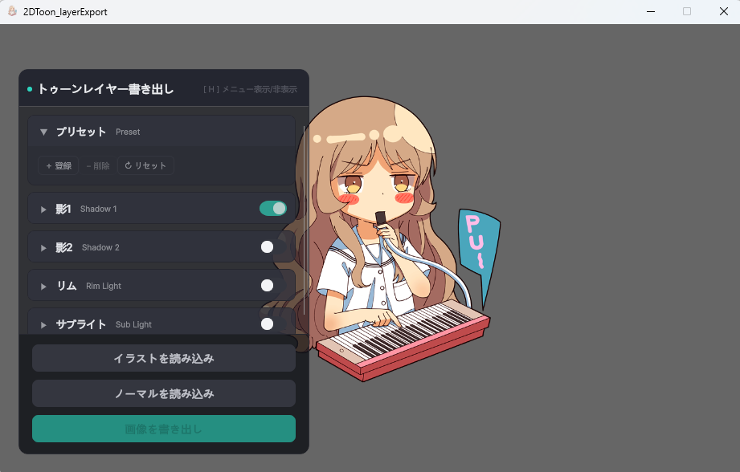
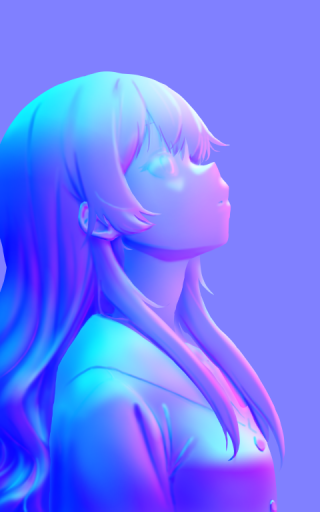
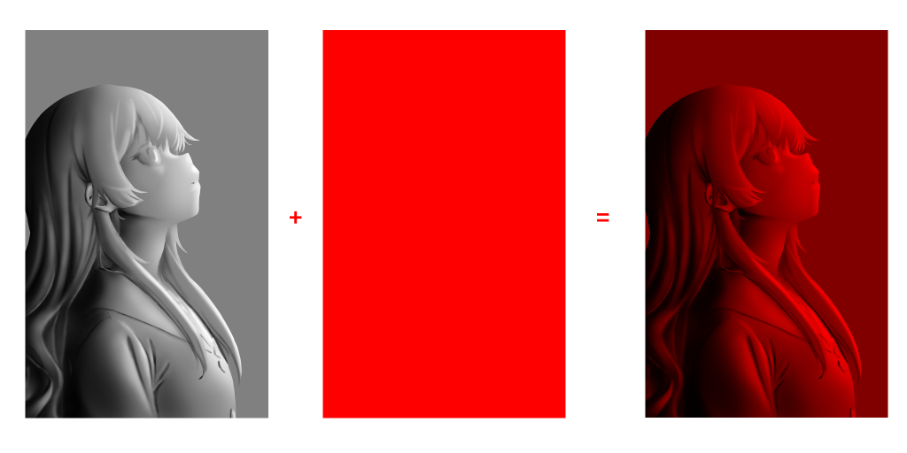
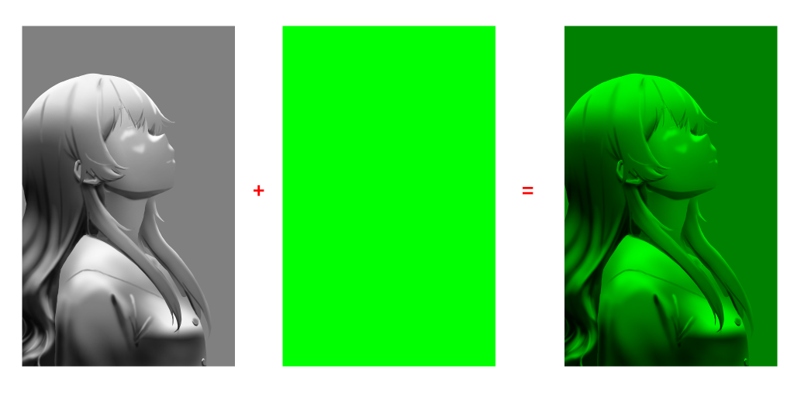
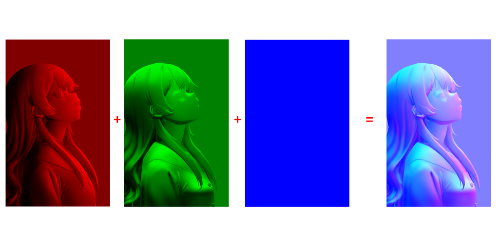

# 2D Toon Layer Exporter

イラストとノーマルマップからトゥーンシェーダーを通して陰影を計算し、
計算した陰影をレイヤーごとに分けてPNGに書き出す実験的ツールです。

書き出した PNG は Photoshop や Clip Studio Paint等のペイントソフトに持っていって各レイヤーを合成し直します。

---

## 導入（実行形式の場合）

[RELEASES](https://github.com/ryuga-12z/2d-layer-export/releases/latest)からzipファイルをダウンロードします。
zipを解凍して、解凍フォルダ内の `2DToon_layerExport.exe` をダブルクリックで起動します。

#### 動作環境

- **OS**：Windows 10 / 11（64bit）
- **GPU**：DirectX 11 対応　VRAM: 2GB以上推奨
- **メモリ**：4GB 以上

---

## 導入（UnityEditorの場合）

任意の空フォルダで`git clone`して下さい。
UnityHub側でAdd project from disk で clone したフォルダを指定します。
Unity バージョン 6.3+ を選んで Openします。

上手く動かない場合は[SETUP](docs/SETUP.md)を参照して下さい。

---

##  使い方

1. ツールを起動する
2. 画面下の **「イラストを読み込み」** から絵を選ぶ
3. **「ノーマルを読み込み」** からノーマルマップを選ぶ
4. パネルのスライダーで陰影を調整する
5. **「画像を書き出し」** を押して保存先とファイル名を決める
6. 指定した場所に PNG が 5 枚出力される

イラストを読み込むと、ウィンドウが画像の縦横比に合わせて変形します。

詳細は[使い方ガイド](docs/USAGE.md)へ。

 

#### 必要なもの

**イラスト** 線画+下塗りの状態。背景を抜いた透過PNG推奨
**ノーマルマップ** イラストと同じサイズのノーマルマップ画像
**(任意)影テクスチャ** 線画を外した下塗りの色を影色に変えたもの。陰影を任意の色にしたいときに

 

#### ノーマルマップについて

紫っぽい色の画像の事を指します。本来は3DCGなどで平面にちょっとした立体感を付けるために使うものです。
この画像内のキャラクターやオブジェクトの面がどの方向を向いているか、が色情報で保存されています。
これを使って陰影を計算しているので、無いと陰影が出ません。

画像からノーマルマップを作る方法は大きく分けて二つ

- **手描きする**

実は手で描けます。作り方は大まかに
 - 右から光が当たってることを想定してモノクロで陰影を描く→別レイヤーでRGBのRだけ最大にした色を乗算で重ねる(グループ1) 

 - 上から光が当たってることを想定してモノクロで陰影を描く→別レイヤーでRGBのGだけ最大にした色を乗算で重ねる（グループ2）

 - グループ1の上にグループ2をスクリーンで重ね、RGBのBだけ最大にした色を置いたレイヤーを更に上からスクリーンで重ねる

です。

興味がある方は「ノーマルマップ　手描き」等で検索してみて下さい。

 

- **自動生成ツールを使う**

画像からノーマルマップを自動生成するツールやアドオンが各所から多く出ています。
中にはAIでノーマルマップを生成するツールもあるようなので、AIに抵抗感がない方は探してみて下さい。

 

ただし手描きの方が手間がかかる分、精度も高いです。

---

## ライセンス

MIT License — 詳細は [LICENSE](LICENSE) を参照してください。

同梱している第三者のアセット（フォント等）のライセンス表記は [THIRD-PARTY-NOTICES.md](THIRD-PARTY-NOTICES.md) にまとめています。
